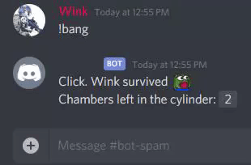
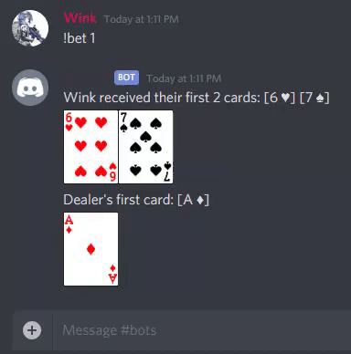
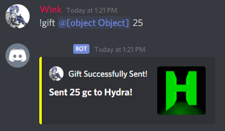
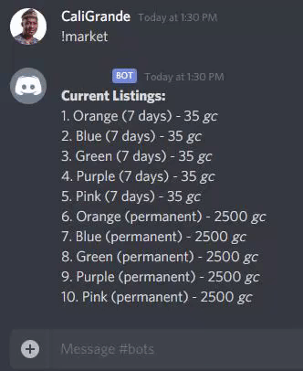
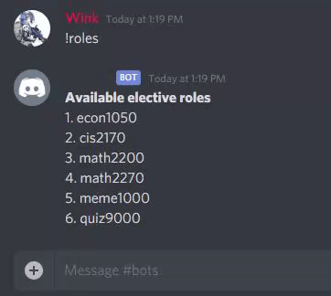
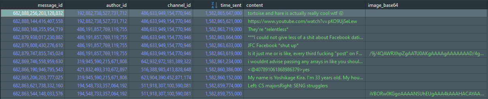
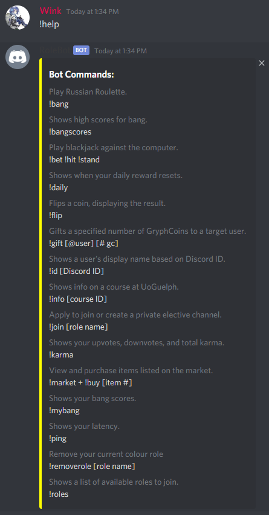

Version 2.2
# Purpose
This is a Discord bot intended to provide entertainment to users of the
University of Guelph Bachelor of Computer Science Discord server.

# Technologies
Written in Java with JDA API and built with Gradle.  
Using MariaDB to store user info, game data, and message logs.  
Hosted on a Google Cloud server with 24/7 uptime.

# Features

### Play Russian Roulette

### Earn money in black jack

### Track your scores

### Share the love

### Spend money on profile customization

### Instantly create and join private channels

### Log Messages and File Uploads

### And much much more

# Want to Contribute?
All inquiries should be sent to Wink#0001 on Discord.
I am always open to improving the bot in any way!
